

## 1.研究背景

随着工业化进程的不断推进，机械设备在生产过程中扮演着至关重要的角色。而轴承作为机械设备中的重要组成部分，其运行状态的稳定性直接影响到整个设备的性能和寿命。然而，由于长时间的运行和各种外界因素的影响，轴承容易出现各种缺陷，如磨损、裂纹、断裂等。因此，开发一种高效准确的轴承缺陷检测系统对于确保机械设备的正常运行和提高生产效率具有重要意义。

传统的轴承缺陷检测方法主要依赖于人工目视检查或使用特定的仪器设备进行检测。然而，这些方法存在着许多问题。首先，人工目视检查需要大量的人力资源和时间，且存在主观性和疲劳度的问题，容易导致漏检和误检。其次，特定的仪器设备通常价格昂贵，操作复杂，需要专业技能和经验，不适用于大规模的生产环境。因此，研究开发一种自动化、高效准确的轴承缺陷检测系统成为迫切需求。

近年来，深度学习技术的快速发展为轴承缺陷检测提供了新的解决方案。YOLOv5（You Only Look Once）是一种基于深度学习的目标检测算法，具有高效、准确和实时的特点。相比于传统的目标检测算法，YOLOv5在速度和精度上都有显著的提升，适用于复杂场景下的目标检测任务。因此，将YOLOv5应用于轴承缺陷检测系统中，可以有效地提高检测的准确性和效率。


# 2.研究意义：
基于YOLOv5轴承缺陷检测系统的研究具有以下几个方面的意义：

1. 提高轴承缺陷检测的准确性：传统的轴承缺陷检测方法容易受到人为因素的影响，而基于YOLOv5的自动化检测系统可以减少人为干扰，提高检测的准确性和一致性。

2. 提高轴承缺陷检测的效率：基于YOLOv5的检测系统可以实现实时检测，大大缩短了检测时间，提高了生产效率。同时，该系统可以自动化地进行检测，减少了人力资源的消耗。

3. 降低轴承缺陷检测的成本：传统的轴承缺陷检测方法需要昂贵的仪器设备和专业技能，而基于YOLOv5的检测系统可以通过普通的摄像设备实现，降低了检测的成本。

4. 推动深度学习技术在工业领域的应用：基于YOLOv5的轴承缺陷检测系统是深度学习技术在工业领域的一次成功应用，将为其他领域的自动化检测和智能化生产提供借鉴和参考。

# 3.图片演示
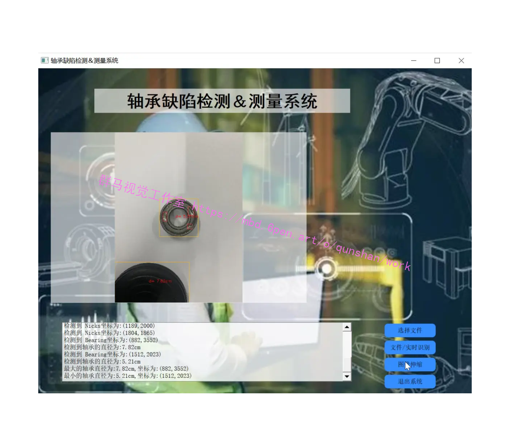

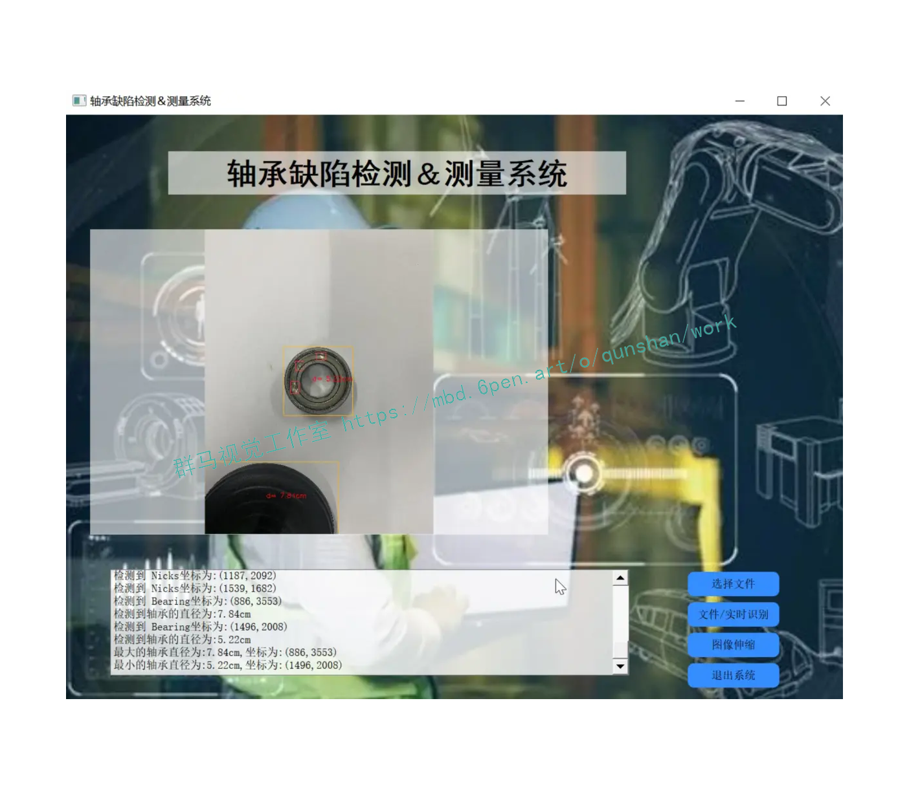

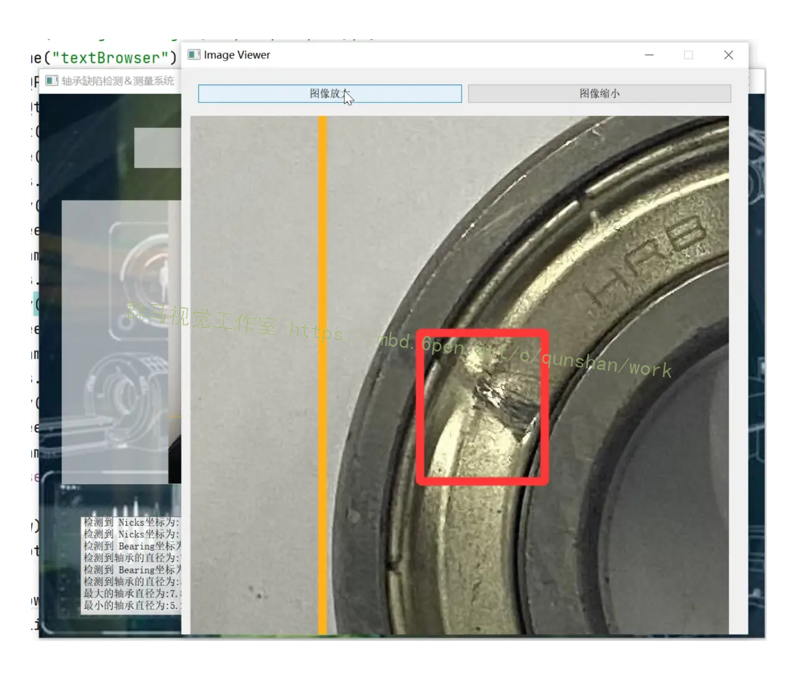

# 4.视频演示
[基于改进YOLOv5的轴承表面缺陷测量系统（部署教程＆源码）_哔哩哔哩_bilibili](https://www.bilibili.com/video/BV1HN411B7Hi/?vd_source=ff015de2d29cbe2a9cdbfa7064407a08)


## 5.核心代码讲解

#### 5.1 anchor.py

```python
import torch
from models.experimental import attempt_load

class ModelAnalyzer:
    def __init__(self, model_path):
        self.model_path = model_path
    
    def load_model(self):
        model = attempt_load(self.model_path, map_location=torch.device('cpu'))
        return model
    
    def get_anchor_grid(self, model):
        m = model.module.model[-1] if hasattr(model, 'module') else model.model[-1]
        return m.anchor_grid

# Usage
model_path = './best.pt'
analyzer = ModelAnalyzer(model_path)
model = analyzer.load_model()
anchor_grid = analyzer.get_anchor_grid(model)
print(anchor_grid)
```

这个程序文件名为anchor.py，主要功能是加载模型并打印出模型中的anchor_grid。

程序首先导入了torch库和attempt_load函数，attempt_load函数是从models.experimental模块中导入的。然后，程序使用attempt_load函数加载了一个模型，模型文件路径为'./best.pt'，并将模型加载到CPU上。

接下来，程序使用条件语句判断模型是否有module属性，如果有，则取出模型的最后一层，并赋值给变量m；如果没有module属性，则直接取出模型的最后一层，并赋值给变量m。

最后，程序打印出变量m的anchor_grid属性。

#### 5.2 deep sort.py

```python
import os
import shutil

class ImageClassifier:
    def __init__(self, path):
        self.path = path
    
    def classify_images(self):
        result = os.listdir(self.path)
        if not os.path.exists('./train'):
            os.mkdir('./train')
        if not os.path.exists('./train/1'):
            os.mkdir('./train/1')
        if not os.path.exists('./test'):
            os.mkdir('./test')
        if not os.path.exists('./test/1'):
            os.mkdir('./test/1')
        num = 0
        for i in result:
            num += 1
            if num % 3 == 0:
                shutil.copyfile(self.path + '/' + i, './train/1' + '/' + i)
            if num % 3 == 1:
                shutil.copyfile(self.path + '/' + i, './train/1' + '/' + i)
            if num % 3 == 2:
                shutil.copyfile(self.path + '/' + i, './test/1' + '/' + i)
        print('分类完成')

path = './Temporary_folder'
classifier = ImageClassifier(path)
classifier.classify_images()
```

这个程序文件名为deep_sort.py，它的功能是将指定文件夹中的图片进行分类。程序首先导入了cv2和numpy库，并设置了一个路径变量path，用于存放需要进行图像增强的图片文件夹。然后使用os库的listdir函数读取文件夹内的文件，并将结果保存在result变量中。接下来，程序判断是否存在train和test文件夹，如果不存在则创建它们，再在train和test文件夹下分别创建1文件夹。然后，程序使用一个循环遍历result中的每个文件，通过判断num除以3的余数来决定将文件复制到train/1文件夹还是test/1文件夹中。最后，程序输出"分类完成"的提示信息。

#### 5.3 example.py

```python
import detect
import os
import shutil

class YOLOv5v6Detector:
    def __init__(self, model_path, test_folder, temp_folder):
        self.model_path = model_path
        self.test_folder = test_folder
        self.temp_folder = temp_folder

    def detect_objects(self):
        result = detect.det_yolov5v6(self.model_path, self.test_folder, self.temp_folder)
        return result

# Example usage
detector = YOLOv5v6Detector('./best.pt', './test', './Temporary_folder')
result = detector.detect_objects()
```

这个程序文件名为example.py，它包含了以下几个部分的代码：

1. 导入模块：程序首先导入了名为detect的模块，以及os和shutil模块。

2. 定义变量：程序定义了一个名为result的变量。

3. 调用函数：程序调用了detect模块中的det_yolov5v6函数，并传入了三个参数：'./best.pt'、'./test'和'./Temporary_folder'。这个函数的作用是使用指定的模型文件'./best.pt'对'./test'目录中的图像进行目标检测，并将结果保存到'./Temporary_folder'目录中。

4. 注释：程序中有一行被注释掉的代码#print(result)。

总体来说，这个程序的功能是使用Yolov5v6模型对指定目录中的图像进行目标检测，并将结果保存到指定目录中。

#### 5.4 hubconf.py

```python
import torch

class YOLOv5:
    def __init__(self, name='yolov5s', pretrained=True, channels=3, classes=80, autoshape=True, verbose=True, device=None):
        self.name = name
        self.pretrained = pretrained
        self.channels = channels
        self.classes = classes
        self.autoshape = autoshape
        self.verbose = verbose
        self.device = device
        self.model = self._create_model()

    def _create_model(self):
        from pathlib import Path
        from models.yolo import Model
        from models.experimental import attempt_load
        from utils.general import check_requirements, set_logging
        from utils.downloads import attempt_download
        from utils.torch_utils import select_device

        file = Path(__file__).resolve()
        check_requirements(exclude=('tensorboard', 'thop', 'opencv-python'))
        set_logging(verbose=self.verbose)

        save_dir = Path('') if str(self.name).endswith('.pt') else file.parent
        path = (save_dir / self.name).with_suffix('.pt')  # checkpoint path
        try:
            device = select_device(('0' if torch.cuda.is_available() else 'cpu') if self.device is None else self.device)

            if self.pretrained and self.channels == 3 and self.classes == 80:
                model = attempt_load(path, map_location=device)  # download/load FP32 model
            else:
                cfg = list((Path(__file__).parent / 'models').rglob(f'{self.name}.yaml'))[0]  # model.yaml path
                model = Model(cfg, self.channels, self.classes)  # create model
                if self.pretrained:
                    ckpt = torch.load(attempt_download(path), map_location=device)  # load
                    msd = model.state_dict()  # model state_dict
                    csd = ckpt['model'].float().state_dict()  # checkpoint state_dict as FP32
                    csd = {k: v for k, v in csd.items() if msd[k].shape == v.shape}  # filter
                    model.load_state_dict(csd, strict=False)  # load
                    if len(ckpt['model'].names) == self.classes:
                        model.names = ckpt['model'].names  # set class names attribute
            if self.autoshape:
                model = model.autoshape()  # for file/URI/PIL/cv2/np inputs and NMS
            return model.to(device)

        except Exception as e:
            help_url = 'https://github.com/ultralytics/yolov5/issues/36'
            s = 'Cache may be out of date, try `force_reload=True`. See %s for help.' % help_url
            raise Exception(s) from e

    def predict(self, imgs):
        return self.model(imgs)


```

这个程序文件是一个用于加载和使用YOLOv5模型的Python脚本。它定义了一个名为`hubconf.py`的模块，可以通过PyTorch Hub加载。以下是该文件的主要功能：

1. `_create`函数：根据指定的模型名称创建一个YOLOv5模型。可以选择是否加载预训练权重、输入通道数、类别数等参数。还可以选择是否应用YOLOv5的`.autoshape()`包装器来处理输入数据。返回创建的模型。

2. `custom`函数：加载自定义或本地模型。可以指定模型的路径。

3. `yolov5n`、`yolov5s`、`yolov5m`、`yolov5l`、`yolov5x`等函数：加载预训练的YOLOv5模型。可以选择模型的大小（nano、small、medium、large、xlarge）。

总之，这个程序文件提供了一种方便的方式来加载和使用YOLOv5模型，可以用于目标检测和图像识别任务。

#### 5.5 location.py

```python
import cv2

class ImageProcessor:
    def __init__(self, image_path):
        self.image = cv2.imread(image_path)
        self.HSV = self.image.copy()
        self.HSV2 = self.image.copy()
        self.list = []

    def resize_image(self):
        height, width, channels = self.image.shape
        if width > 1500 or width < 600:
            scale = 1200 / width
            print("图片的尺寸由 %dx%d, 调整到 %dx%d" % (width, height, width * scale, height * scale))
            scaled = cv2.resize(self.image, (0, 0), fx=scale, fy=scale)
            return scaled, scale

    def get_position(self, event, x, y, flags, param):
        if event == cv2.EVENT_MOUSEMOVE:
            HSV3 = self.HSV2.copy()
            self.HSV = HSV3
            cv2.line(self.HSV, (0, y), (self.HSV.shape[1] - 1, y), (0, 0, 0), 1, 4)
            cv2.line(self.HSV, (x, 0), (x, self.HSV.shape[0] - 1), (0, 0, 0), 1, 4)
            cv2.imshow("imageHSV", self.HSV)
        elif event == cv2.EVENT_LBUTTONDOWN:
            HSV3 = self.HSV2.copy()
            self.HSV = HSV3
            self.list.append([int(x), int(y)])
            print(self.list[-1])

    def process_image(self):
        cv2.imshow("imageHSV", self.HSV)
        cv2.setMouseCallback("imageHSV", self.get_position)
        cv2.waitKey(0)

image_processor = ImageProcessor('./1.jpg')
image_processor.process_image()
```

这个程序文件名为location.py，它使用了OpenCV和NumPy库，并且还引入了matplotlib库的pyplot模块。

该程序定义了一个名为resizeimg的函数，用于调整图像的尺寸。如果图像的宽度大于1500或小于600，函数会将图像的宽度缩放到1200，并返回缩放后的图像和缩放比例。

接下来，程序读取名为1.jpg的图像文件，并创建了一个空列表。

然后，程序进入一个无限循环，循环中的代码用于处理图像。首先，程序将原始图像复制给HSV和HSV2变量。

接下来，程序定义了一个名为getpos的回调函数，用于处理鼠标事件。当鼠标移动时，函数会在HSV图像上绘制一条垂直和一条水平线，并显示更新后的图像。当鼠标左键按下时，函数会将鼠标点击的坐标添加到列表中，并打印出最后一个坐标。

然后，程序显示HSV图像，并将鼠标事件与getpos函数关联起来。

最后，程序等待用户按下任意键后退出。

#### 5.6 test.py

```python

class ImageBox(QWidget):
    def __init__(self):
        super(ImageBox, self).__init__()
        self.img = None
        self.scaled_img = None
        self.point = QPoint(0, 0)
        self.start_pos = None
        self.end_pos = None
        self.left_click = False
        self.scale = 1

    def init_ui(self):
        self.setWindowTitle("ImageBox")

    def set_image(self, img_path):
        """
        open image file
        :param img_path: image file path
        :return:
        """
        # img = QImageReader(img_path)
        # img.setScaledSize(QSize(self.size().width(), self.size().height()))
        # img = img.read()
        self.img = QPixmap(img_path)
        self.scaled_img = self.img

    def paintEvent(self, e):
        """
        receive paint events
        :param e: QPaintEvent
        :return:
        """
        if self.scaled_img:
            painter = QPainter()
            painter.begin(self)
            painter.scale(self.scale, self.scale)
            painter.drawPixmap(self.point, self.scaled_img)
            painter.end()

    def mouseMoveEvent(self, e):
        """
        mouse move events for the widget
        :param e: QMouseEvent
        :return:
        """
        if self.left_click:
            size = self.size().width()
            self.end_pos = e.pos() - self.start_pos
            self.point = self.point + self.end_pos
            self.start_pos = e.pos()
            self.repaint()

    def mousePressEvent(self, e):
        """
        mouse press events for the widget
        :param e: QMouseEvent
        :return:
        """
        if e.button() == Qt.LeftButton:
            self.left_click = True
            self.start_pos = e.pos()

    def mouseReleaseEvent(self, e):
        """
        mouse release events for the widget
        :param e: QMouseEvent
        :return:
        """
        if e.button() == Qt.LeftButton:
            self.left_click = False

class MainDemo(QWidget):
    def __init__(self):
        super(MainDemo, self).__init__()

        self.setWindowTitle("Image Viewer")
        self.setFixedSize(1000, 600)

        self.open_file = QPushButton("Open Image")
        self.open_file.setToolTip("Open the image to view.")
        self.open_file.clicked.connect(self.open_image)
        self.open_file.setFixedSize(150, 30)

        self.zoom_in = QPushButton("")
        self.zoom_in.clicked.connect(self.large_click)
        self.zoom_in.setFixedSize(30, 30)
        in_icon = QIcon("icons/zoomIn.png")
        self.zoom_in.setIcon(in_icon)
        self.zoom_in.setIconSize(QSize(30, 30))

        self.zoom_out = QPushButton("")
        self.zoom_out.clicked.connect(self.small_click)
        self.zoom_out.setFixedSize(30, 30)
        out_icon = QIcon("icons/zoomOut.png")
        self.zoom_out.setIcon(out_icon)
        self.zoom_out.setIconSize(QSize(30, 30))

        w = QWidget(self)
        layout = QHBoxLayout()
        layout.addWidget(self.open_file)
        layout.addWidget(self.zoom_in)
        layout.addWidget(self.zoom_out)
        layout.setAlignment(Qt.AlignLeft)
        w.setLayout(layout)
        w.setFixedSize(300, 50)

        self.box = ImageBox()
        self.box.setFixedSize(500,500)

        layout = QVBoxLayout()
        layout.addWidget(w)
        layout.addWidget(self.box)
        self.setLayout(layout)

    def open_image(self):
        """
        select image file and open it
        :return:
        """
        # img_name, _ = QFileDialog.getOpenFileName(self, "打开图片", "", "All Files(*);;*.jpg;;*.png")
        img_name, _ = QFileDialog.getOpenFileName(self, "Open Image File","","All Files(*);;*.jpg;;*.png;;*.jpeg")
        self.box.set_image(img_name)

    def large_click(self):
        """
        used to enlarge image
        :return:
        """
        if self.box.scale < 2:
            self.box.scale += 0.1
            self.box.adjustSize()
            self.update()

    def small_click(self):
        """
        used to reduce image
        :return:
        """
        if self.box.scale > 0.3:
            self.box.scale -= 0.2
            self.box.adjustSize()
            self.update()

```

这个程序是一个简单的图像查看器，文件名为test.py。它使用PyQt5库来创建一个图形用户界面。程序包含两个主要的类：ImageBox和MainDemo。

ImageBox类是一个继承自QWidget的自定义小部件，用于显示图像。它包含了一些成员变量，如img（原始图像）、scaled_img（缩放后的图像）、point（图像在窗口中的位置）、start_pos（鼠标按下时的位置）、end_pos（鼠标移动时的位置）、left_click（鼠标左键是否按下）和scale（图像的缩放比例）。它还包含了一些方法，如init_ui（初始化界面）、set_image（打开图像文件）、paintEvent（绘制图像）、mouseMoveEvent（处理鼠标移动事件）、mousePressEvent（处理鼠标按下事件）和mouseReleaseEvent（处理鼠标释放事件）。

MainDemo类是一个继承自QWidget的主窗口类，用于显示图像查看器的主界面。它包含了一些成员变量，如open_file（打开图像文件按钮）、zoom_in（放大按钮）、zoom_out（缩小按钮）和box（ImageBox实例）。它还包含了一些方法，如open_image（选择图像文件并打开）、large_click（放大图像）和small_click（缩小图像）。

在程序的主函数中，创建了一个QApplication实例和一个MainDemo实例，并显示主窗口。

这个程序的功能是打开图像文件并在窗口中显示，用户可以通过鼠标拖动图像来移动图像的位置，通过点击放大和缩小按钮来调整图像的大小。

# 6.YOLOv5 目标检测算法介绍
YOLOv5s结构如图2-1所示，由输入端，Backbone，Neck和 Head组成。输入端将四张图片随机缩放、随机裁剪和随机排布的方式拼接，进行Mosaic数据增强并且提升网络的训练速度。然后经过Focus切片，进入由CSP结构和SPP结构组成的 Backbone，从输入图像中提取丰富的特征。再由特征金字塔[62](FeaturePyramid Networks,FPN)结构和PAN结构组成的Neck部分将不同尺度特征融合，最后由Head输出端进行预测,输出预测框的损失、框的大小是损失和类别的损失，下文介绍YOLOv5s的具体结构组成。
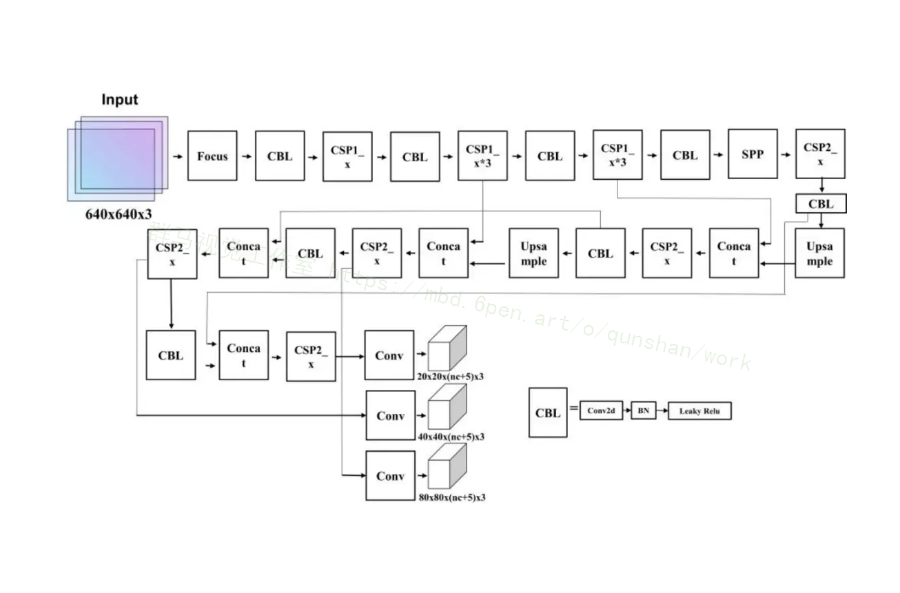

YOLOv5s和 YOLOv4目标检测算法在 Backbone中都采用了CSP结构与DarkNet 网络的结合，其中 YOLOv4在 Backbone中，将CSP与 DarNet53结合，增加了Backbone的学习能力，并且在保证准确率的同时，减少了网络的计算量。YOLOv5s不仅将CSP结构用于Backbone，也用于Neck 层，YOLOv5s 中使用了2种不同形式的CSP结构，一种是CSP1_x，输入的分支
一经过CBL卷积模块、多个残差结构和一个卷积层，分支二直接进入卷积层，分支一与分支二进行Concat运算后,经过标准化、激活函数和CBL卷积模块进行输出,CSP1_x用于Backbone;另一种是CSP2_x，与CSP1_x不同的是在分支一中用多个卷积模块替代了原来的残差结构，CSP2_x用于Neck部分。CSPl_x是为了避免网络加深后的梯度消失的问题，而Neck部分网络深度浅，所以选用CSP2_x,
结构如图所示:
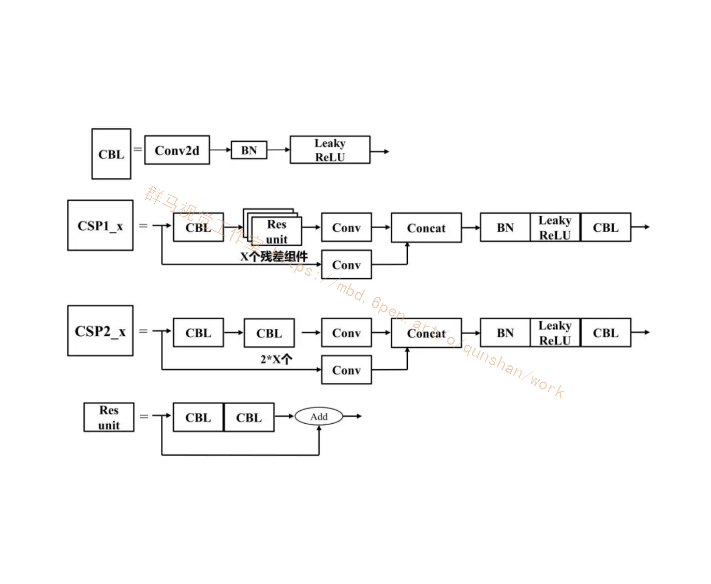

# 7.YOLOv5的改进
#### 7.1 自适应图像裁剪预处理

参考该博客提出的方案，采用了传统图像算法完成对推力球轴承图片预处理。预处理过程如图3-1所示，图像预处理步骤如下:
(1）通过获取图像中心圆区域灰度值的平均值获得背景平均灰度值 Xaveraage对原图像获得阈值分割，得到图3-2(b);
(2）对于阈值分割后的图像进行填充，获得图3-2(c)，根据填充的区域得到推力球轴承的中心的位置(Xcentral， Yeentral);
(3）根据推力球轴承的中心的位置对生成与检测区域相近的圆环得到图3-2(d)，并且从原图提取圆环区域获得图3-2(e); 。
(4）根据推力球轴承的中心对图3-2(e)进行采集，获得预处理后的图像3-2(f) 。
图片做完预处理后对其标注框的值进行转换，原标注框的信息为(X，Y， Width,Height)，其中点X和Y分别为目标框的中心点横坐标和纵坐标与图片宽度和高度的比值，Width和 Height分别为目标框的宽和高与图片宽度和高度的比值，图像预处理更新后的坐标为(X*, Y*, Width*,Height*)。
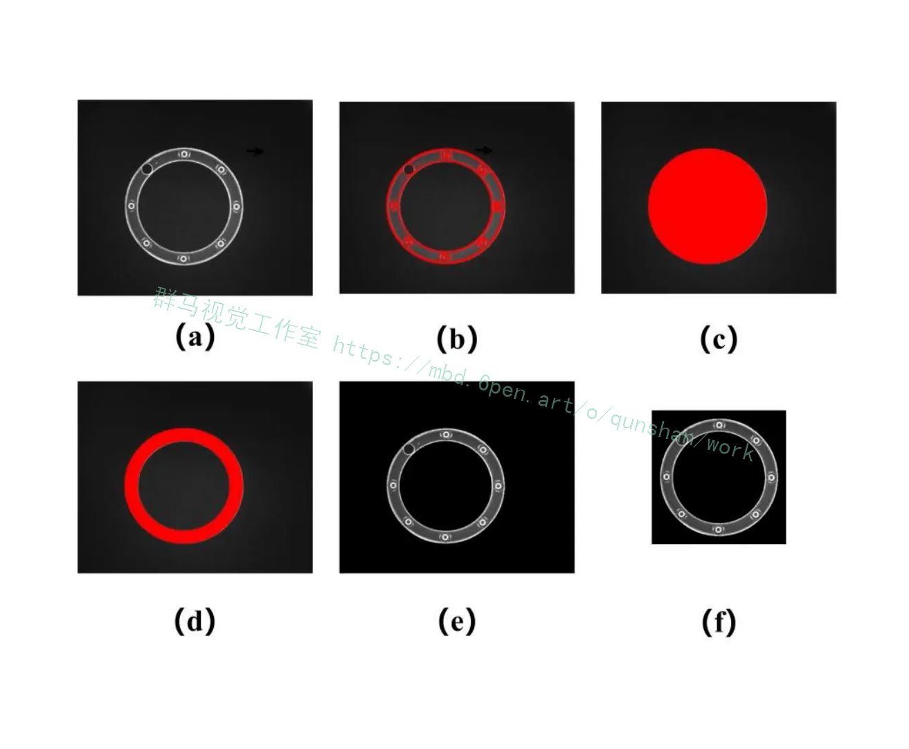

#### 7.2 引入Transformer
谷歌团队在2018年提出的用于生成词向量的BERT算法，并且在自然语言处理的任务中取得了效果的大幅提升，而 BERT 算法的最重要的部分便是本文中提出的Transformer 的概念。Transformcr和传统的CNN和RNN 网络结构不同，整个网络是完全仅由注意力机制和前馈神经网络组成。传统的RNN机制的必须是按照一定顺序进行计算的，这种机制限制了模型的并行计算能力，并且在计算过程中会导致信息的丢失。
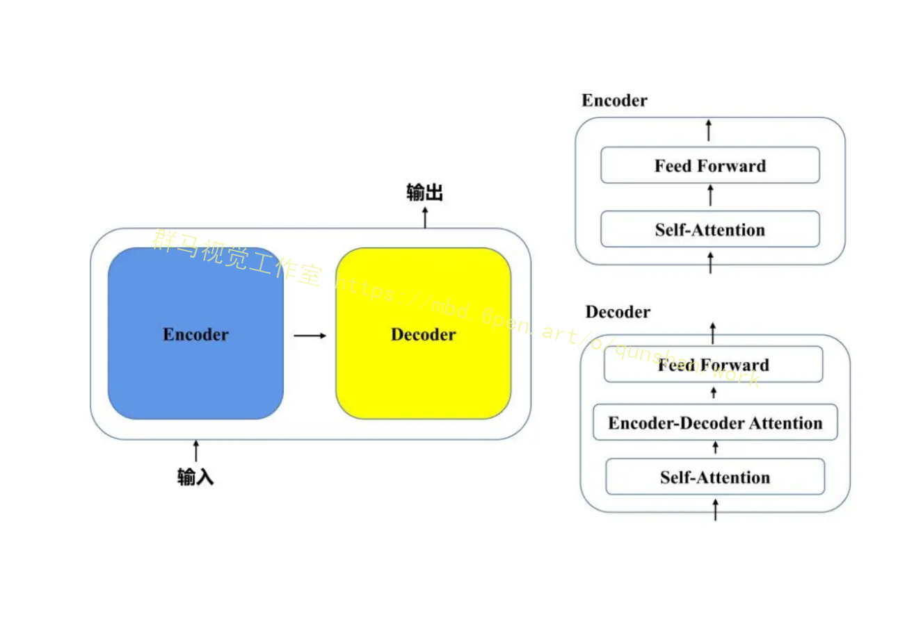
Transformer的提出解决了上面使用传统RNN机制的两个问题,首先它使用注意力机制，将序列中的任何两个位置之间的距离缩小为一个常量;其次它不是类似RNN的顺序结构，因此具有更好的并行性，符合现有的GPU框架格式。
Transformer(图）本质上是一个由编码器(Encoder）和解码器（Decoder）组成的结构，编码器的输出作为解码器的输入。一个编码层由一个自注意力机制加上一个前馈层组成，一个解码层由一个自注意力机制加上一个编码转解码注意力机制和一个前馈层组成。
Transformer的输入X乘以三个不同的权值矩阵w'、wK、W'得到三个不同的向量，分别是Query向量o，Key向量K和Value向量V作为编码层的输入到Self-Attention模块。首先通过Query向量Q点乘Key向量K的转置计算两个矩阵的相似度得到Score,对Score除以d,进行归一化处理,接着对Score使用SoftMax函数得到每个通道的重要性程度大小,最后点乘Value向量V得到每个输入向量的评分。计算过程如公式所示:
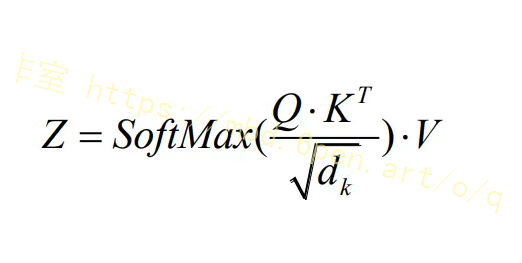
Transformer采用的是多头自注意力机制(Multi-Head Attention)，将若干个Self-Attention模块集成在一个整体模块，具体过程将输入X分别输入到若干个Self-Attention模块得到若干个加权后的特征矩阵，然后对加权后的特征矩阵进行全连接后得到输出，Transformer完整结构如图所示:
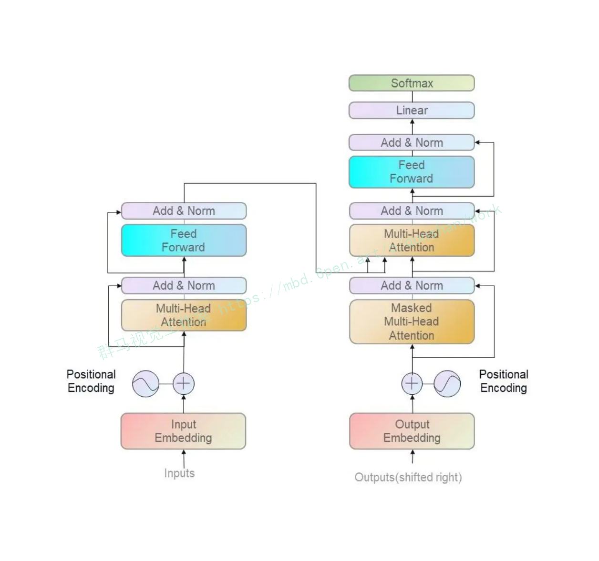

#### 7.3 引入VariFocalNe
参考该博客作者提出的学习可同时表示对象存在置信度和定位精度的loU感知分类评分(IACS)，以在密集对象检测器中产生更准确的检测等级。特别地本文还设计了一个新的损失函数Q，称为Varifocal损失，用于训练密集的物体检测器来预测IACS，并设计了一种新的高效星形边界框特征表示，用于估算IACS和改进粗略边界框。结合这两个新组件和边界框优化分支，作者在FCOS架构上构建了一个新的密集目标检测器，简称为VarifocalNet或VFNet。
本文提出学习loU-aware classification score(IACS)用于对检测进行分级。为此在去掉中心分支的FCOS+ATSS的基础上，构建了一个新的密集目标检测器，称为VarfocalNe或VFNet。相比FCOS+ATSS融合了varifcoal loss、star-shaped bounding box特征表示和boundingbox refinement 3个新组件。
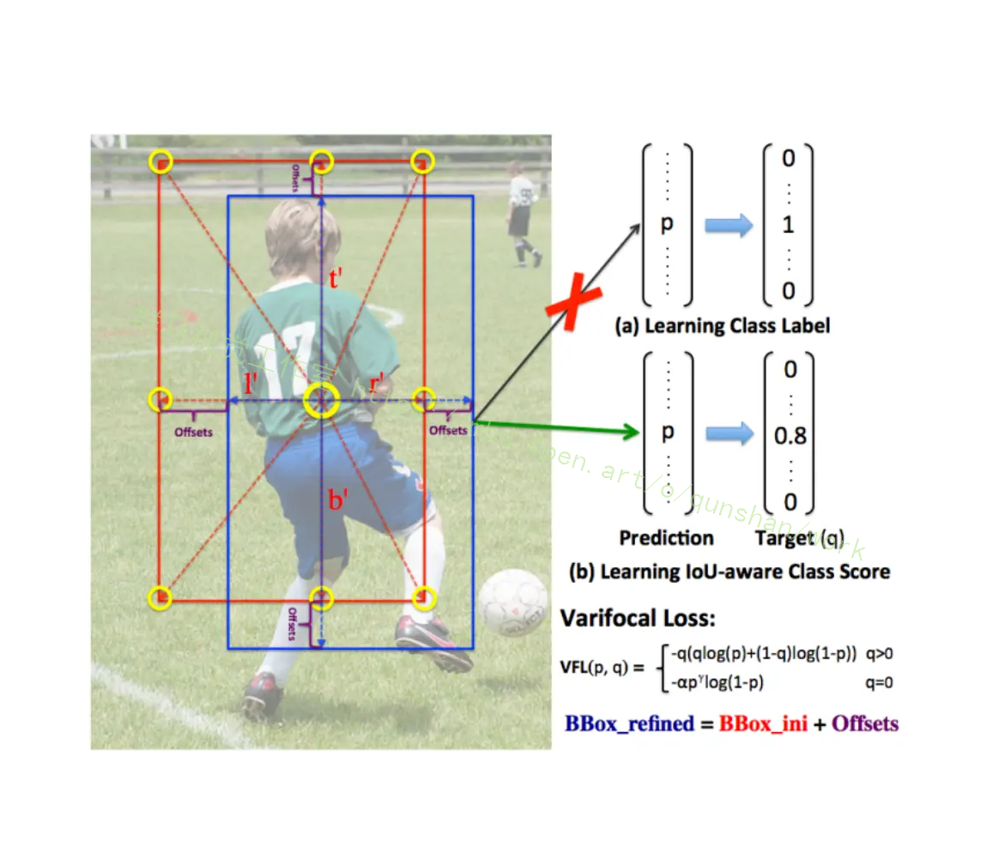
本文设计了一种用于IACS预测的Star-Shaped Box特征表示方法。它利用9个固定采样点的特征(图2中的黄色圆圈)表示一个具有可变形卷积的bounding box。这种新的表示方法可以捕获bounding box的几何形状及其附近的上下文信息，这对于编码预测的bounding box和ground-truth之间的不对齐是至关重要的。
具体来说:
1.首先，给定图像平面上的一个采样位置(或feature map上的一个投影点)，首先用卷积从它回归一个初始bounding box;
2.然后，在FCOS之后，这个bounding box由一个4D向量编码，这意味着位置分别到bounding box的左、上、右和下侧的距离。利用这个距离向量启发式地选取....和9个采样点，然后将它们映射到feature map上。它们与(x, y)投影点的相对偏移量作为可变形卷积的偏移量;
3.最后，将这9个投影点上的特征使用可变形卷积卷积表示一个bounding box。由于这些点是人工选择的,没有额外的预测负担。

通过bounding box细化步骤进一步提高了目标定位的精度。bounding box细化是目标检测中常用的一种技术但由于缺乏有效的、有判别性的目标描述符，在密集的目标检测器中并未得到广泛应用。有了Star-Shaped Box特征表示现在可以在高密度物体探测器中采用它，而不会损失效率。
这里将bounding box细化建模为一个残差学习问题。对于初始回归的bounding box:·首先,提取Star-Shaped Box特征表示并对其进行编码。然后，根据表示学习4个距离缩放因子来缩放初始距离向量，使表示的细化bounding box更接近ground-truth。
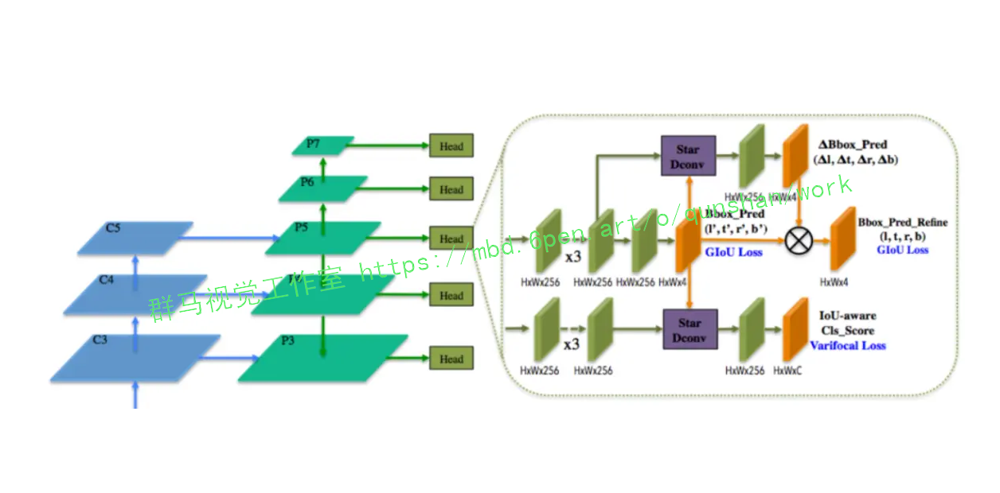

## 8.系统整体结构

整体功能和构架概述：

该项目是一个基于Yolov5v6.0的目标检测工程，主要用于训练、测试和使用YOLOv5模型进行目标检测任务。它包含了多个文件，每个文件都有不同的功能，如模型定义、数据处理、训练、测试、界面展示等。

以下是每个文件的功能概述：

| 文件路径 | 功能概述 |
| -------- | -------- |
| anchor.py | 加载模型并打印模型中的anchor_grid |
| deep_sort.py | 将指定文件夹中的图片进行分类 |
| detect.py | 使用指定模型对图像进行目标检测 |
| example.py | 加载和使用YOLOv5模型的示例程序 |
| export.py | 导出模型为ONNX格式 |
| hubconf.py | 加载和使用YOLOv5模型的模块 |
| location.py | 图像位置标定工具 |
| test.py | 图像查看器 |
| train.py | 训练YOLOv5模型 |
| ui.py | 图形用户界面相关功能 |
| val.py | 对训练后的模型进行验证 |
| 1\ui.py | 图形用户界面相关功能 |
| models\common.py | YOLOv5模型的通用函数和类 |
| models\experimental.py | YOLOv5模型的实验性函数和类 |
| models\tf.py | YOLOv5模型的TensorFlow相关函数和类 |
| models\yolo.py | YOLOv5模型的主要定义 |
| models\__init__.py | 模型初始化文件 |
| utils\activations.py | 激活函数相关功能 |
| utils\augmentations.py | 数据增强相关功能 |
| utils\autoanchor.py | 自动计算anchor相关功能 |
| utils\autobatch.py | 自动批处理相关功能 |
| utils\callbacks.py | 回调函数相关功能 |
| utils\datasets.py | 数据集相关功能 |
| utils\downloads.py | 下载相关功能 |
| utils\general.py | 通用功能函数 |
| utils\loss.py | 损失函数相关功能 |
| utils\metrics.py | 评估指标相关功能 |
| utils\plots.py | 绘图相关功能 |
| utils\torch_utils.py | PyTorch工具函数 |
| utils\__init__.py | 工具函数初始化文件 |
| utils\aws\resume.py | AWS相关功能 |
| utils\aws\__init__.py | AWS初始化文件 |
| utils\flask_rest_api\example_request.py | Flask REST API示例请求 |
| utils\flask_rest_api\restapi.py | Flask REST API相关功能 |
| utils\loggers\__init__.py | 日志记录器初始化文件 |
| utils\loggers\wandb\log_dataset.py | WandB日志记录器相关功能 |
| utils\loggers\wandb\sweep.py | WandB日志记录器相关功能 |
| utils\loggers\wandb\wandb_utils.py | WandB日志记录器相关功能 |
| utils\loggers\wandb\__init__.py | WandB日志记录器初始化文件 |

以上是粗略的功能概述，具体功能可能需要参考第8小节的详细内容。

# 8.系统整合
下图[完整源码＆环境部署视频教程＆数据集＆自定义UI界面](https://s.xiaocichang.com/s/d6719b)
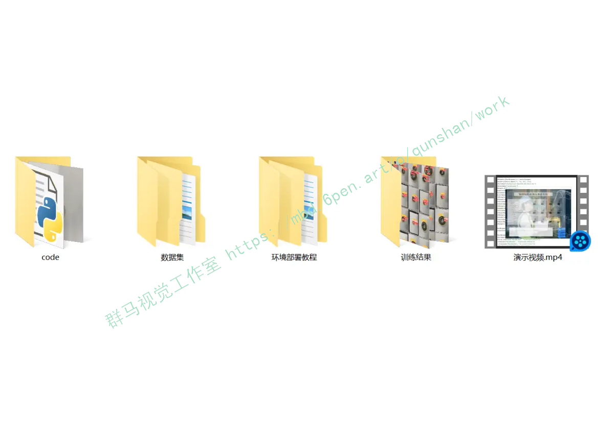

参考博客[《基于改进YOLOv5的轴承表面缺陷测量系统（部署教程＆源码）》](https://mbd.pub/o/qunshan/work)

# 9.参考文献
---
[1][丁勇](https://s.wanfangdata.com.cn/paper?q=%E4%BD%9C%E8%80%85:%22%E4%B8%81%E5%8B%87%22),[洪涛](https://s.wanfangdata.com.cn/paper?q=%E4%BD%9C%E8%80%85:%22%E6%B4%AA%E6%B6%9B%22).[基于改进型U-Net卷积神经网络的磁片表面缺陷检测](https://d.wanfangdata.com.cn/periodical/zgbzh202113043)[J].[中国标准化](https://sns.wanfangdata.com.cn/perio/zgbzh).2021,(13).DOI:10.3969/j.issn.1002-5944.2021.13.030.

[2][李浪怡](https://s.wanfangdata.com.cn/paper?q=%E4%BD%9C%E8%80%85:%22%E6%9D%8E%E6%B5%AA%E6%80%A1%22),[刘强](https://s.wanfangdata.com.cn/paper?q=%E4%BD%9C%E8%80%85:%22%E5%88%98%E5%BC%BA%22),[邹一鸣](https://s.wanfangdata.com.cn/paper?q=%E4%BD%9C%E8%80%85:%22%E9%82%B9%E4%B8%80%E9%B8%A3%22),等.[基于改进YOLOv5算法的轨面缺陷检测](https://d.wanfangdata.com.cn/periodical/wydxxb202103007)[J].[五邑大学学报（自然科学版）](https://sns.wanfangdata.com.cn/perio/wydxxb).2021,(3).DOI:10.3969/j.issn.1006-7302.2021.03.007.

[3][周神特](https://s.wanfangdata.com.cn/paper?q=%E4%BD%9C%E8%80%85:%22%E5%91%A8%E7%A5%9E%E7%89%B9%22),[王宇宇](https://s.wanfangdata.com.cn/paper?q=%E4%BD%9C%E8%80%85:%22%E7%8E%8B%E5%AE%87%E5%AE%87%22),[张潇](https://s.wanfangdata.com.cn/paper?q=%E4%BD%9C%E8%80%85:%22%E5%BC%A0%E6%BD%87%22),等.[基于机器视觉的金属板材表面缺陷光学检测技术](https://d.wanfangdata.com.cn/periodical/wsjc202009009)[J].[无损检测](https://sns.wanfangdata.com.cn/perio/wsjc).2020,(9).DOI:10.11973/wsjc202009009.

[4][李维刚](https://s.wanfangdata.com.cn/paper?q=%E4%BD%9C%E8%80%85:%22%E6%9D%8E%E7%BB%B4%E5%88%9A%22),[叶欣](https://s.wanfangdata.com.cn/paper?q=%E4%BD%9C%E8%80%85:%22%E5%8F%B6%E6%AC%A3%22),[赵云涛](https://s.wanfangdata.com.cn/paper?q=%E4%BD%9C%E8%80%85:%22%E8%B5%B5%E4%BA%91%E6%B6%9B%22),等.[基于改进YOLOv3算法的带钢表面缺陷检测](https://d.wanfangdata.com.cn/periodical/dianzixb202007006)[J].[电子学报](https://sns.wanfangdata.com.cn/perio/dianzixb).2020,(7).DOI:10.3969/j.issn.0372-2112.2020.07.006.

[5][张磊](https://s.wanfangdata.com.cn/paper?q=%E4%BD%9C%E8%80%85:%22%E5%BC%A0%E7%A3%8A%22),[郎贤礼](https://s.wanfangdata.com.cn/paper?q=%E4%BD%9C%E8%80%85:%22%E9%83%8E%E8%B4%A4%E7%A4%BC%22),[王乐](https://s.wanfangdata.com.cn/paper?q=%E4%BD%9C%E8%80%85:%22%E7%8E%8B%E4%B9%90%22).[基于图像融合与YOLOv3的铝型材表面缺陷检测](https://d.wanfangdata.com.cn/periodical/jsjyxdh202011003)[J].[计算机与现代化](https://sns.wanfangdata.com.cn/perio/jsjyxdh).2020,(11).DOI:10.3969/j.issn.1006-2475.2020.11.002.

[6][邓超](https://s.wanfangdata.com.cn/paper?q=%E4%BD%9C%E8%80%85:%22%E9%82%93%E8%B6%85%22),[刘岩岩](https://s.wanfangdata.com.cn/paper?q=%E4%BD%9C%E8%80%85:%22%E5%88%98%E5%B2%A9%E5%B2%A9%22).[基于边缘检测的斜纹布匹瑕疵检测](https://d.wanfangdata.com.cn/periodical/ckjs201812026)[J].[测控技术](https://sns.wanfangdata.com.cn/perio/ckjs).2018,(12).DOI:10.19708/j.ckjs.2018.12.026.

[7][牛乾](https://s.wanfangdata.com.cn/paper?q=%E4%BD%9C%E8%80%85:%22%E7%89%9B%E4%B9%BE%22),[刘桂华](https://s.wanfangdata.com.cn/paper?q=%E4%BD%9C%E8%80%85:%22%E5%88%98%E6%A1%82%E5%8D%8E%22),[康含玉](https://s.wanfangdata.com.cn/paper?q=%E4%BD%9C%E8%80%85:%22%E5%BA%B7%E5%90%AB%E7%8E%89%22).[磁粉探伤钢轴表面裂纹智能识别方法研究](https://d.wanfangdata.com.cn/periodical/zdhyb201803014)[J].[自动化仪表](https://sns.wanfangdata.com.cn/perio/zdhyb).2018,(3).DOI:10.16086/j.cnki.issn1000-0380.2017060033.

[8][许明奇](https://s.wanfangdata.com.cn/paper?q=%E4%BD%9C%E8%80%85:%22%E8%AE%B8%E6%98%8E%E5%A5%87%22),[郑红威](https://s.wanfangdata.com.cn/paper?q=%E4%BD%9C%E8%80%85:%22%E9%83%91%E7%BA%A2%E5%A8%81%22),[曲琼](https://s.wanfangdata.com.cn/paper?q=%E4%BD%9C%E8%80%85:%22%E6%9B%B2%E7%90%BC%22).[圆柱滚子失效原因分析](https://d.wanfangdata.com.cn/periodical/zc201408010)[J].[轴承](https://sns.wanfangdata.com.cn/perio/zc).2014,(8).DOI:10.3969/j.issn.1000-3762.2014.08.010.

[9][梁华](https://s.wanfangdata.com.cn/paper?q=%E4%BD%9C%E8%80%85:%22%E6%A2%81%E5%8D%8E%22),[王姗姗](https://s.wanfangdata.com.cn/paper?q=%E4%BD%9C%E8%80%85:%22%E7%8E%8B%E5%A7%97%E5%A7%97%22),[仇亚军](https://s.wanfangdata.com.cn/paper?q=%E4%BD%9C%E8%80%85:%22%E4%BB%87%E4%BA%9A%E5%86%9B%22),等.[轴承钢球表面缺陷分析方法](https://d.wanfangdata.com.cn/periodical/zc201306014)[J].[轴承](https://sns.wanfangdata.com.cn/perio/zc).2013,(6).DOI:10.3969/j.issn.1000-3762.2013.06.014.

[10][叶浩](https://s.wanfangdata.com.cn/paper?q=%E4%BD%9C%E8%80%85:%22%E5%8F%B6%E6%B5%A9%22),[吴昌虎](https://s.wanfangdata.com.cn/paper?q=%E4%BD%9C%E8%80%85:%22%E5%90%B4%E6%98%8C%E8%99%8E%22),[张斌](https://s.wanfangdata.com.cn/paper?q=%E4%BD%9C%E8%80%85:%22%E5%BC%A0%E6%96%8C%22),等.[我国钢球生产工艺装备及发展展望](https://d.wanfangdata.com.cn/periodical/ahkj201311021)[J].[安徽科技](https://sns.wanfangdata.com.cn/perio/ahkj).2013,(11).41-42.DOI:10.3969/j.issn.1007-7855.2013.11.021.


---
#### 如果您需要更详细的【源码和环境部署教程】，除了通过【系统整合】小节的链接获取之外，还可以通过邮箱以下途径获取:
#### 1.请先在GitHub上为该项目点赞（Star），编辑一封邮件，附上点赞的截图、项目的中文描述概述（About）以及您的用途需求，发送到我们的邮箱
#### sharecode@yeah.net
#### 2.我们收到邮件后会定期根据邮件的接收顺序将【完整源码和环境部署教程】发送到您的邮箱。
#### 【免责声明】本文来源于用户投稿，如果侵犯任何第三方的合法权益，可通过邮箱联系删除。